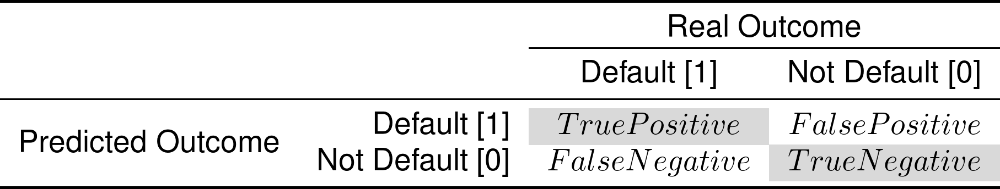
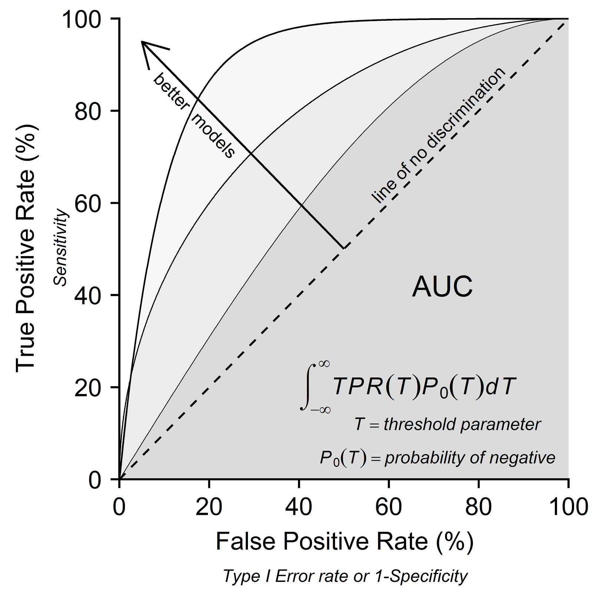

*Assessing Classification Models*
=================================

Increasingly the modern modelling environment expects researchers to assess their models within a machine-learning framework. This approach randomly divides records from the original dataset into training and test sets (aka. 'development' and 'holdout' sets).

Models can fit noise in the data rather than genuine structures (i.e. 'overfitting'), and this causes overestimates of predictive performance when models are assessed on the same data. Separate training and testing data sets produces the most accurate assessments (Korb & Nicholson, 2011, p.183).

The proportion of all data records used in credit risk test sets ranges from 10% to 50% (Anderson, 2007, p.351). Between 20% and 30% is normal Siddiqi (2006, p.63). A 30% test set ensured the minimum 300 defaults necessary for validation (Mays & Lynas, 2010, p.75) with at least 1,500 defaults, not defaults and rejected records each for the 70% training set.

All records in the experimental data set can be randomly shuffled after importation and randomly sampled into the two data sets. The training set is then used to 'teach' data structures to statistical models in isolation from the test set. Those trained models can then used to predict test set outcomes to produce performance estimates on industry-sourced data independent from training.

The Confusion Matrix
--------------------

The goal of assessment is to compare model performance differences in a manner that is meaningful on the branch-level. This can be pursued by using industry-accepted assessments to measure how well each model predicts real data.

Most models can output unique predictions of the test set data. They can be assessed based on the efficacy of those predictions. This is equivalent to a lender applying a model to industry-sourced data, building a new model, and predicting default risk in a customer population.

A widely accepted approach of assessing classification models is to use figures and statistics generated from a 'confusion matrix'. This is a two by two matrix "obtained by cross-classifying the predicted class of objects from the population by their true class" (Hand, 1997, p.7). An example confusion matrix is shown in the table below.

Table. *Confusion Matrix: Real Outcome by Predicted Outcome*

The cross-classification between predicted and real outcomes produces four cells. Real outcomes determine the Boolean prefix, 'True' or 'False', within each cell. Predicted outcomes determine the binary suffix, 'Positive' or 'Negative'. This means that all 'True' records were correctly classified, all 'False' records were misclassified, all 'Positive' records were predicted as positive, and all 'Negative' records were predicted as negative. Cells are abbreviated as TP, FP, FN and TN. Note that cell labels are reversed when the direction of coding is reversed (i.e. if 'default' were coded as 0 and 'not default' was predicted).

Several assessment statistics can be computed to compare model test set predictions. Two measures from classical statistics applied to credit scoring are *Type I Error* and *Type II Error* (Anderson, 2007, p.190). The error counts are already reported in the confusion matrix, *False Positive* and *False Negative* cells respectively, and each are divided by an appropriate sample space to be reported as error rates. The sample space for the *Type I Error* rate is all real negatives (i.e. not default). It is the proportion of real negatives incorrectly classified as positive (FP/FP+TN). The sample space for the *Type II Error* rate is all real positives (i.e. default). It is the proportion of real positives incorrectly classified as negative (FN/FN+TP). *Type II Error* is important in credit scoring because the cost of accepting applicants likely to default is "greater than the cost of denying credit to a good risk candidate" (West, 2000, p.1147).

Two supplementary rates are *Accuracy* and an overall measure of *Error*. The sample space for both rates is all records. *Accuracy* is the proportion of records correctly classified (TP+TN/TOTAL) and *Error* is the proportion of records incorrectly classified (FP+FN/TOTAL).

Predicted Probabilities
-----------------------

Most models output a predicted probability of positive class membership between 0 and 1. However, confusion matrix cell counts and related statistics are only valid for a specific threshold or 'operating point', chosen as an acceptable likelihood for positive class membership. Two approaches can be used to navigate this restriction.

The first approach is to choose operating points based on market share. Model performance can be compared with confusion matrices calculated at 'operationally logical deciles' for a predetermined market approval rate (Siddiqi, 2006, p.125). Common model comparisons are a 70% and a 90% approval rate. This is simulated by accepting (i.e. classifying as 0) test set applicants with the lowest predicted likelihood of default up to those market shares. Confusion matrix values can be calculated for each share.

The second approach is to calculate summary statistics that are overall measures of model performance. Two examples include a variation on *Type II Error* creates by the author and a statistic from the Receiver Operating Characteristic (ROC) curve.

### Type II Error

*False Negatives* are relatively more costly than *False Positives*, and as Bradley (1997) states "it is not misclassification rate we want to minimise, but rather misclassification cost" (p.5). One lending strategy is to accept applicants only up to an expected default rate that the lender can absorb. A statistic that can measure performance in this areas is to simulate the number of applicants that could be accepted without exceeding a 5% *Type II Error* rate. Better models correctly classify (e.g. accept) the most applicants before breaching the 5% *Type II* (e.g. credit default) threshold.

### ROC Curve

Statistics calculated from the ROC curve are ubiquitous in binary classification problems (Hanley & McNeil, 1982; Bradley, 1997). The ROC curve is visualised on a ROC plot and requires two additional rates, *Sensitivity* and *Specificity*, with domains including all operating points. These two rates use the same two sampling spaces as *Type I* and *Type II Error* rates, except that rather than being rates of 'False' (i.e. misclassified) records, they are rates of 'True' (i.e. correctly classified) records.

The *True Positive Rate*, also called *Sensitivity*, is the proportion of real positives correctly classified as positive within the sample space of all real positives (TP/FN+TP). The complement, 1 - *True Positive Rate* or the *False Negative Rate*, is the same as the *Type II Error* rate (i.e. real positives incorrectly classified as negative).

The *True Negative Rate*, also called *Specificity*, is the proportion of real negatives correctly classified as negative within the sample space of all real negatives (TN/FP+TN). The complement, 1 - *True Negative Rate* or the *False Positive Rate*, is the same as the *Type I Error* rate (i.e. real negatives incorrectly classified as positive).

A ROC plot has the *True Positive Rate* on the *y*-axis, and the complement of *True Negative Rate*, meaning *Type I Error* rate or 1 - *Specificity*, on the *x*-axis. Anderson (2007) summarises these as 'hits' (*y*) and 'false alarms' (*x*). These "two degrees of freedom are presented simultaneously for a range of possible classification thresholds for the classifier" (Hand, 1997, p.132). An example ROC plot is shown in the figure below.

*Figure.* ROC Plot Example Curves and AUC Space

The three simulated ROC curves in Figure 2 depict three different classifier models. Together, all the points making up a ROC curve describe how a model will perform using different thresholds or operating points for the classifier.

The diagonal line through the ROC plot, the 'line of no discrimination', signifies a random guess. A model with a ROC curve along this '*True Positive Rate = False Positive Rate*' line will classify the same proportion of records to positive in both real class outcomes. Better models have curves away from this line and closer to the top left of the plane. This indicates that the model achieved higher proportions of correctly classified positives while maintaining lower proportions of misclassified negatives.

The ROC curve is interpreted as the *True Positive Rate* domain against the *False Positive Rate* domain. For the coding system used in this project, this meant the proportion of correctly classified defaults (i.e. positives, 1) against the proportion of misclassified not defaults (i.e. negatives, 0).

The ROC curve combines the information gained from both axes. The area underneath it can be integrated as a single value of classifier performance across all possible thresholds. This statistic is called the Area Under Curve (AUC) and it can be reported for all model ROC curves. Values of 0.5 indicate a 'line of no discrimination' random guess, with better models being closer to a value of 1, indicating 100% area under curve. Some practitioners use the *Gini* coefficient, which converts from AUC as twice the area between the curve and the 'line of no discrimination' (Hand & Henley, 1993).

One final note of caution. With global statistics and with operating point values, models with inferior 'global' performance can produce superior 'local' performance at a specific optimal operating point for that model. Modellers should be aware of this phenomenon as it can be used for isolating the point at which their models are most effective.

References
==========

Anderson, R. (2007). The Credit Scoring Toolkit: Theory and Practice for Retail Credit Risk Management and Decision Automation. New York, USA: Oxford University Press.

Bradley, A.P. (1997). The use of the area under the ROC curve in the evaluation of machine learning algorithms. Pattern Recognition, 30, 1145-1159.

Hand, D.J. (1997). Construction and Assessment of Classification Rules. England, UK: John Wiley & Sons Ltd.

Hand, D.J., Henley, W.E. (1993). Can reject inference ever work? IMA Journal of Mathematics Applied in Business & Industry, 5, 45-55.

Hanley, J.A., McNeil, B.J. (1982). The meaning and use of the area under a receiver operating characteristic (ROC) curve. Radiology, 143, 29-36.

Korb, K.B., Nicholson, A.E. (2011). Bayesian Artificial Intelligence (2nd ed., p.183). Boca Raton, Florida, USA: CRC Press.

Mays, E., Lynas, N. (2010). Credit Scoring for Risk Managers: The Handbook for Lenders. Lexington, KY: CreateSpace Independent Publishing Platform.

Siddiqi, N. (2006). Credit Risk Scorecards: Developing and Implementing Intelligent Credit Scoring. New Jersey, USA: John Wiley & Sons, Inc.

West, D. (2000). Neural network credit scoring models. Computers & Operations Research, 27, 1131-1152.
